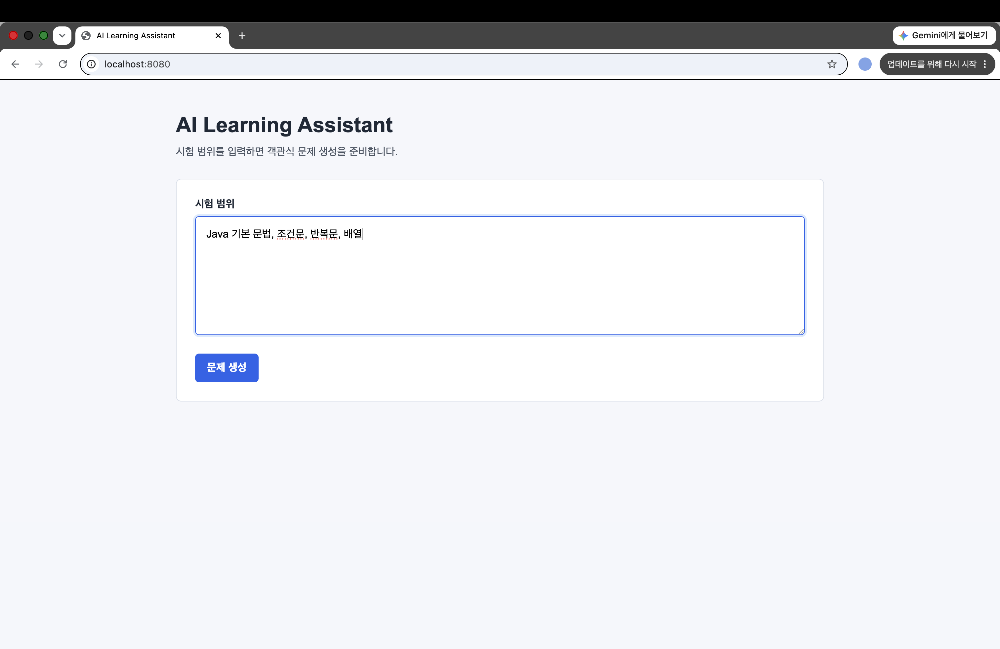
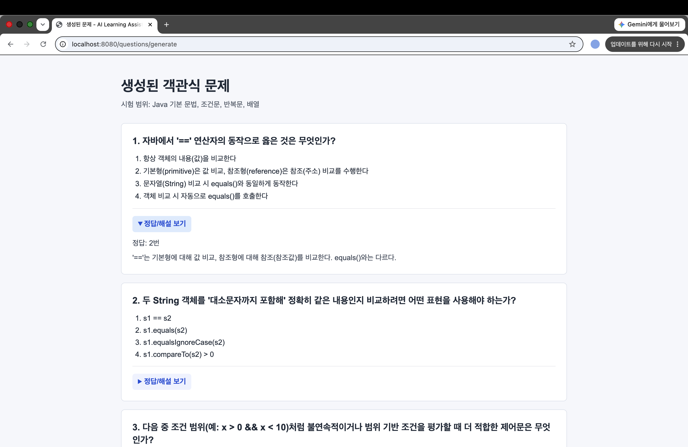
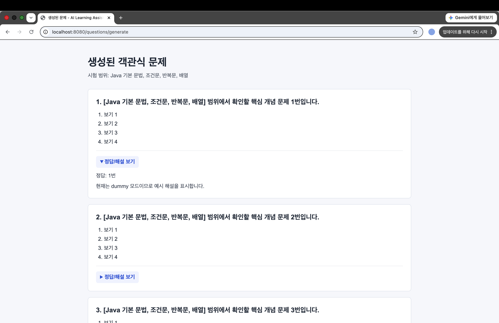

# AI Learning Assistant

LG유플러스 유레카 교육과정에서 학습한 내용을 복습하고, 매 챕터마다 진행되는 시험을 대비하기 위해 만든 Spring Boot + Thymeleaf 기반 학습 보조 웹 애플리케이션입니다.

사용자가 브라우저에서 시험 범위를 입력하면 객관식 문제 10개를 생성하고, 각 문제의 보기, 정답, 해설을 확인할 수 있습니다.

## 프로젝트를 만든 이유

LG유플러스 유레카 교육과정에서는 Java, Spring Boot 등 여러 개념을 빠르게 학습하고, 각 챕터가 끝날 때마다 시험을 보게 됩니다.

시험 전에는 다음과 같은 어려움이 있었습니다.

- 시험 범위를 기준으로 예상 문제를 직접 만들기 번거롭다.
- 개념을 읽기만 하면 제대로 이해했는지 확인하기 어렵다.
- 객관식 문제를 풀면서 복습하면 부족한 부분을 더 쉽게 찾을 수 있다.

그래서 시험 범위만 입력하면 AI가 예상 문제를 생성해 스스로 이해도를 점검할 수 있는 학습 도우미를 만들었습니다.

## 기술 스택

- Java 21
- Spring Boot 4.1.0
- Gradle
- Thymeleaf
- Lombok
- OpenAI Responses API
- HTML / CSS

별도의 React 프론트엔드나 데이터베이스 없이, Spring Boot와 Thymeleaf만 사용해 화면과 서버 로직을 함께 구현했습니다.

## 주요 기능

- 시험 범위 입력
- 객관식 문제 10개 생성
- 각 문제별 보기 4개 표시
- 정답 및 해설 확인
- 정답/해설 접기 기능
- 입력값 검증
- API Key 없이 동작하는 dummy 모드
- Dummy/OpenAI Provider 선택 구조

## 화면

### 시험 범위 입력 화면



### OpenAI 문제 생성 결과



### Dummy Provider 결과



## 프로젝트 구조

```text
src/main/java/com/example/ailearningassistant
 ├── home      # 메인 화면 요청 처리
 ├── question  # 문제 생성 요청, 검증, 서비스, 더미 Provider
 ├── openai    # OpenAI Provider, API 요청, 응답 파싱
 └── health    # 서버 상태 확인 API

src/main/resources
 ├── templates # Thymeleaf 화면
 └── static    # CSS 등 정적 파일
```

문제 생성 기능은 `AiQuestionClient` 인터페이스를 기준으로 분리했습니다.

```text
QuestionController
 → QuestionGenerationService
 → AiQuestionClient
     → DummyQuestionClient
     → OpenAiQuestionClient
```

이 구조 덕분에 Controller와 Service는 실제로 어떤 AI Provider를 사용하는지 알 필요가 없습니다. 나중에 Gemini, Claude, Ollama 같은 다른 LLM을 사용하고 싶다면 새로운 Client 클래스를 추가하는 방식으로 확장할 수 있습니다.

## AI와 함께 개발한 과정

기능을 작은 단위로 나누어 AI와 함께 빠르게 프로토타입을 구현하고, 생성된 코드를 그대로 사용하는 대신 직접 실행·검증하며 각 클래스의 역할과 프로젝트 구조를 이해하는 방식으로 반복적으로 개선했습니다.

진행 과정은 다음과 같습니다.

1. Spring Boot 프로젝트 기본 구조 생성
2. Thymeleaf 기반 입력 화면 구현
3. 문제 생성 Controller와 Service 분리
4. dummy 모드로 문제 생성 기능 구현
5. 결과 화면과 정답/해설 접기 기능 구현
6. OpenAI Provider 구조 추가
7. 입력값 검증, 예외 처리, 테스트 코드 작성
8. README와 실행 방법 정리

## Prompt Engineering

문제 생성 품질을 높이기 위해 OpenAI에 전달하는 프롬프트를 구체적으로 설계했습니다.

단순히 문제 생성을 요청하는 것이 아니라 다음 내용을 명확히 지정했습니다.

- AI의 역할: 학습 평가용 객관식 문제를 만드는 교육 전문가
- 문제 개수: 10문항
- 보기 개수: 각 문제당 4개
- 문제 방향: 단순 암기보다 개념 이해 중심
- 응답 내용: 정답 번호와 해설 포함
- 응답 형식: JSON Schema 기반 구조

또한 OpenAI Responses API의 Structured Output(JSON Schema)을 활용해 문제 개수, 보기 개수, 정답 번호, 해설 필드를 일정한 구조로 생성하도록 구성했습니다.

이를 통해 AI 응답 형식을 안정화하고, 애플리케이션에서 응답을 파싱하고 검증하는 과정을 단순화했습니다.

## Dummy Provider를 추가한 이유

현재는 `dummy` 모드를 기본 실행 모드로 사용합니다.

```properties
ai.provider=${AI_PROVIDER:dummy}
```

개발 과정에서 외부 API에만 의존하면 기능 구현과 테스트가 어려울 수 있기 때문에, API Key 없이도 동일한 흐름을 테스트할 수 있도록 Dummy Provider를 함께 구현했습니다.

이를 통해 AI Provider를 교체하거나 실제 API를 사용할 수 없는 환경에서도 동일한 Controller와 Service를 유지한 채 개발을 계속할 수 있도록 구성했습니다.

OpenAI API quota가 부족하면 다음과 같은 오류가 발생할 수 있습니다.

```text
429 TOO_MANY_REQUESTS
code: insufficient_quota
```

이 경우 코드 문제가 아니라 OpenAI 계정의 API 사용 가능량 또는 결제 설정 문제입니다.

## 실행 방법

기본 실행은 API Key가 필요 없는 `dummy` 모드입니다.

```bash
./gradlew bootRun
```

브라우저에서 아래 주소로 접속합니다.

```text
http://localhost:8080
```

OpenAI 모드를 사용하려면 환경변수를 설정한 뒤 실행합니다.

```bash
AI_PROVIDER=openai OPENAI_API_KEY=본인_API_키 OPENAI_MODEL=gpt-5-mini ./gradlew bootRun
```

STS에서는 Run Configuration의 `Environment` 탭에 아래 값을 추가하면 됩니다.

```text
AI_PROVIDER=openai
OPENAI_API_KEY=본인_API_키
OPENAI_MODEL=gpt-5-mini
```

## 테스트

```bash
./gradlew test
```

## 프로젝트를 통해 배운 점

- AI에게 원하는 결과를 얻기 위해서는 기능을 작은 단위로 나누고 요구사항을 구체적으로 전달하는 것이 중요하다는 것을 경험했습니다.
- 생성된 코드를 그대로 사용하는 것이 아니라, 구조를 이해하고 검증하는 과정이 필요하다는 것을 배웠습니다.
- 특정 AI(OpenAI)에 의존하지 않도록 인터페이스를 활용해 Provider를 분리하는 구조를 설계해 보았습니다.
- Spring Boot에서 Controller, Service, Provider의 역할을 나누면 기능 변경과 테스트가 쉬워진다는 것을 알게 되었습니다.

## 앞으로 개선할 부분

- 문제 난이도 선택 기능
- 문제 개수 선택 기능
- 생성된 문제 저장 기능
- 오답 노트 기능
- Gemini, Claude, Ollama 등 다른 LLM Provider 추가
